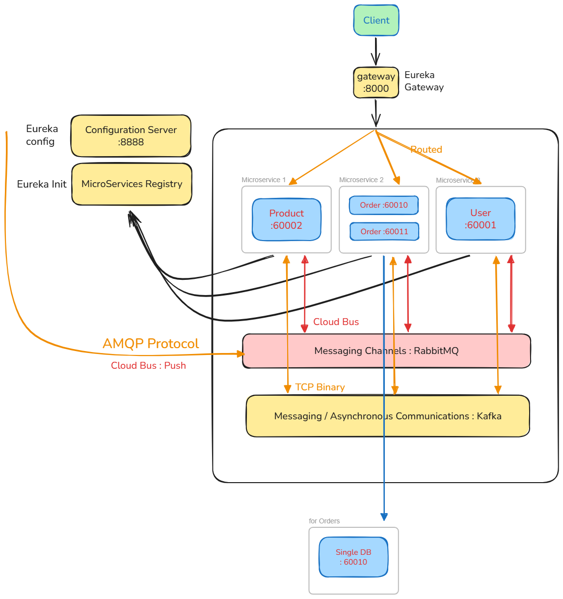
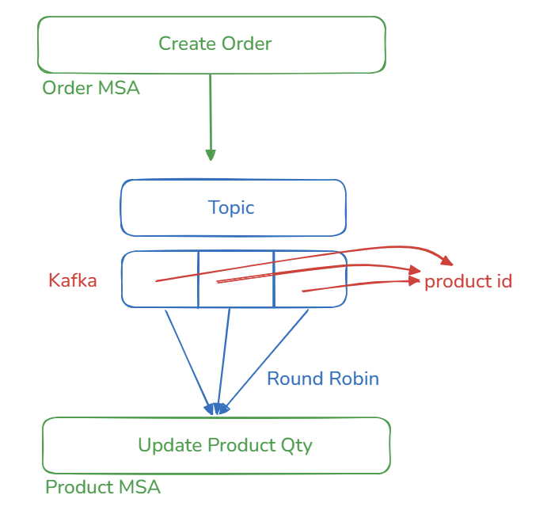

## 1.  개요

- Java ver 21.
- Spring Boot ver 3.5.0 / Spring Cloud 2025.0.x Northfields

> System

> SAGA

> Study
- 본 프로젝트는 MSA Project 설계 및 구현 등에 대한 공부 내용을 담고 있으며, 실전에 바로 투입할 수 있을 정도의 깊이로 학습한 내용을 반영한다. 
- 이 프로젝트는 기본적으로 향후 Cloud Native 환경 구축을 위한 기본적인 뼈대이다.
  - CI/CD
    - Continuous Deployment(DevOps/Pipeline)

## 2. MicroService - User Service

중앙 유레카 서버에 User 마이크로 서비스를 등록하기 위한 목적의 프로젝트이다.

## 3. 통신환경

| Docker Service  | Spring `application.name` (Container Name) | Host Port | Container Port | 비고                   |
| --------------- | ------------------------------------------ | --------- | -------------- | -------------------- |
| eureka          | eureka                                     | 8761      | 8761           | Service Registry     |
| config-server   | config-server                              | 8888      | 8888           | Config Server        |
| gateway         | gateway                                    | 8000      | 8000           | API Gateway          |
| user-service    | user-service                               | 60000     | 60000          | User 서비스             |
| order-service-1 | order-service                              | 60010     | 60010          | Order 인스턴스 1         |
| order-service-2 | order-service                              | 60011     | 60011          | Order 인스턴스 2 (RR 대상) |
| product-service | product-service                            | 60002     | 60002          | Product 서비스          |
| kafka           | kafka                                      | 9092      | 9092           | Kafka Broker         |
| rabbitmq        | rabbitmq                                   | 5672      | 5672           | AMQP 메시지 브로커         |
| mysql-user      | mysql-user                                 | 3306      | 3306           | User DB              |
| mysql-order     | mysql-order                                | 3307      | 3306           | Order DB             |
| mysql-product   | mysql-product                              | 3308      | 3306           | Product DB           |
